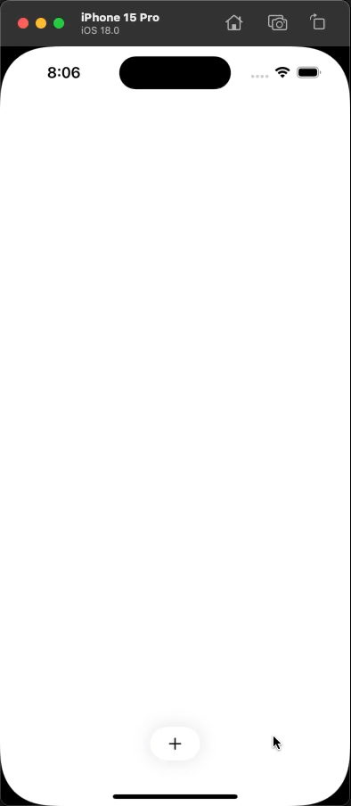
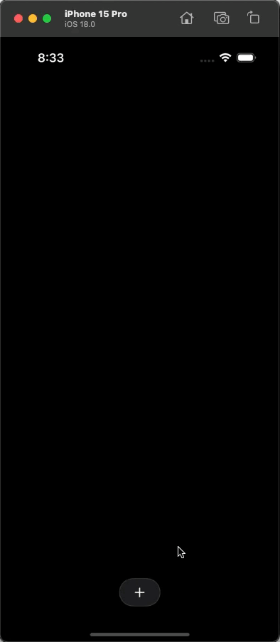

# SwiftUI Interactions Demo

This small project was inspired by a [post](https://x.com/duyluongdesign/status/1820866485151301815) I saw on X by [@duyluongdesign](https://twitter.com/duyluongdesign). I really loved the design he created and more importantly, the lovely, fluid animations when interacting with the component.

I love making things in SwiftUI and thought it would be a fun challenge to recreate what I had seen.

|Duy Luong's Version|
|-|
||

|My Version|
|-|
| |

There are lot of great bits and pieces that someone newer to SwiftUI may be able to learn from this project. SwiftUI is a simple looking tool but quite advanced under the hood and is capable of very powerful stuff. It's also easy to misuse. This project isn't going to teach you how to architect anything in SwiftUI but you might learn a thing or two about animations or some View modifiers

Tear this project apart, make it better, or adjust a few things. Learn SwiftUI! ✌️

## Prerequisites

- Xcode version 16.0 beta 6 (16A5230g)
  - It might be able to run on earlier versions 🤷‍♂️

## License

This project is licensed under the [MIT License](LICENSE).
